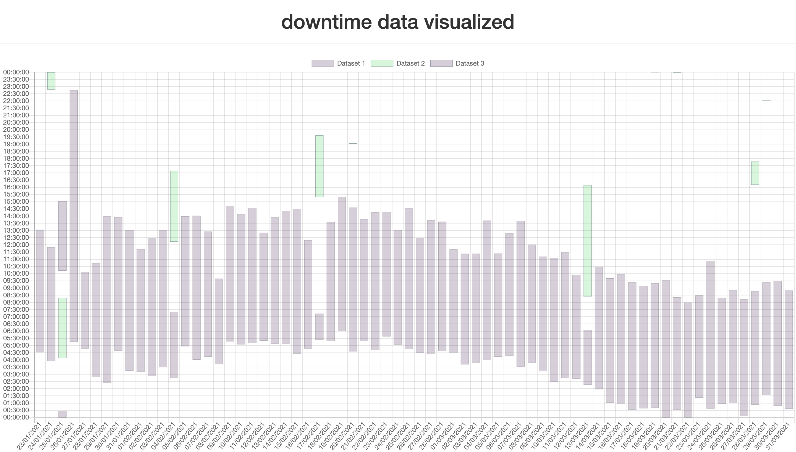

# An uptime tracker for your macOS

(or maybe more of a downtime-tracker acutally)

At first I wrote a few scripts to track whenever you turn your macOS on and off.

In order for them to work you need to execute the following to lines in your Terminal:
```
sudo defaults write com.apple.loginWindow LoginHook /path/to/script/start_star_logger.sh
```

```
sudo defaults write com.apple.loginWindow LogoutHook /path/to/script/start_shutdown_logger.sh
```
(You can certainly also make an Automator-app to do that for you if you do not like to work with the terminal 😉)

In addition I wrote a small django-web-app to present the data visually(using chart.js).
You can see a screenshot of the app below.
The code for the webapp is in the ``data_visualizing_web_app`` directory.

You can start the web app with the following commands.

```
cd data_visualizing_web_app
python manage.py runserver
```


